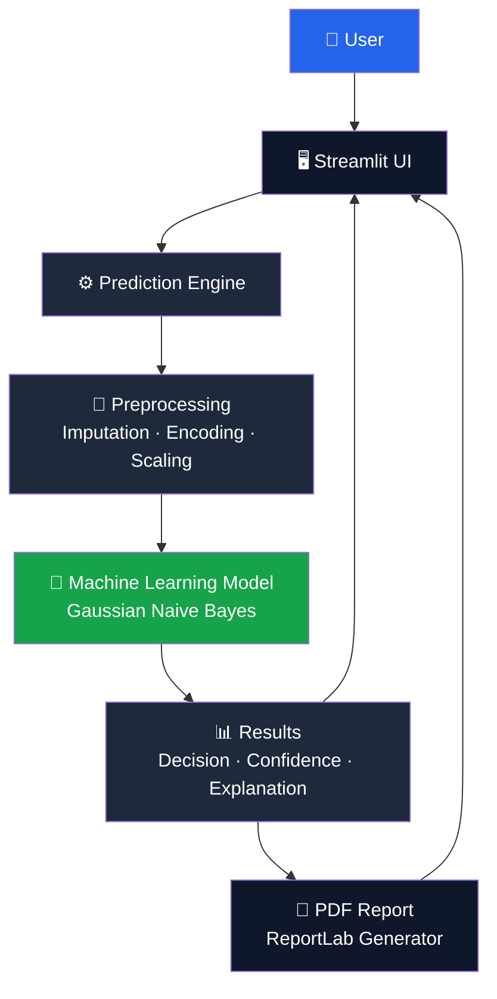
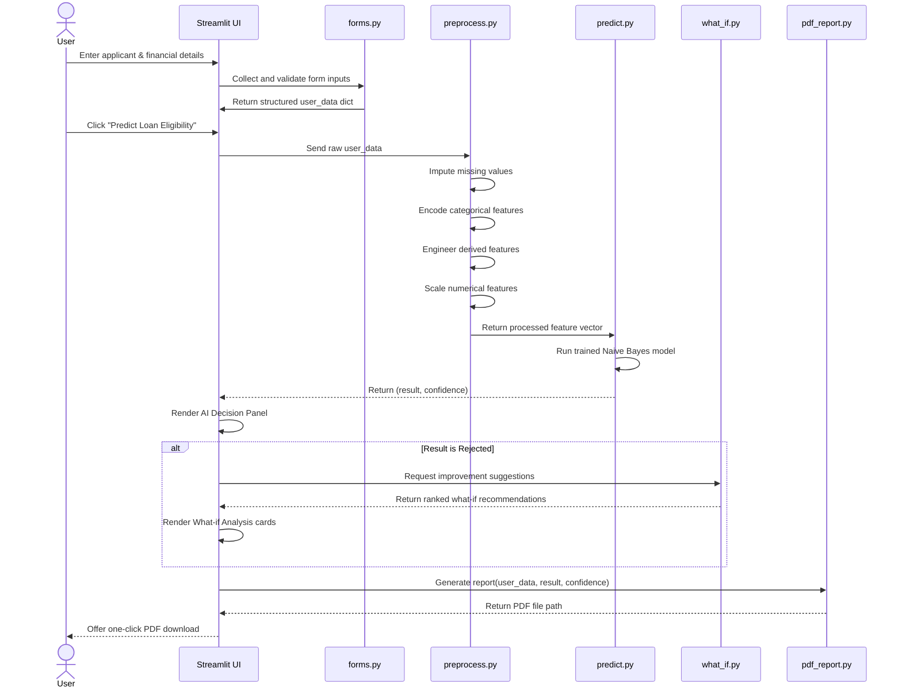

<div align="center">

# 🏦 Credence AI

### Machine Learning Loan Approval System

**Enterprise-grade Machine Learning application for instant, explainable loan eligibility decisions.**

<p>
  
  
  
</p>

<p>
  
  
  
  
  
  
</p>

[Overview](#-overview) •
[Features](#-key-features) •
[Installation](#-installation) •
[Architecture](#-architecture-diagram) •
[Contributing](#-contributing)

</div>

---

## 📚 Table of Contents

- [Overview](#-overview)
- [Key Features](#-key-features)
- [Architecture Diagram](#-architecture-diagram)
- [Workflow Diagram](#-workflow-diagram)
- [Folder Structure](#-folder-structure)
- [Dataset Description](#-dataset-description)
- [Data Preprocessing](#-data-preprocessing)
- [Feature Engineering](#-feature-engineering)
- [Machine Learning Models](#-machine-learning-models)
- [Model Comparison](#-model-comparison)
- [Why Naive Bayes Was Selected](#-why-naive-bayes-was-selected)
- [Application Walkthrough](#-application-walkthrough)
- [Installation](#-installation)
- [Usage](#-usage)
- [Deployment](#-deployment)
- [Future Improvements](#-future-improvements)
- [Contributing](#-contributing)
- [License](#-license)
- [Author](#-author)
- [Acknowledgements](#-acknowledgements)

---

## 🔎 Overview

**Credence AI** is an enterprise-style Machine Learning application that predicts loan eligibility using an applicant's financial and demographic profile. It is designed to look and feel like a real banking product — not a classroom exercise — with a polished Streamlit dashboard, an explainable AI decision engine, and a bank-grade PDF report generator.

The system takes structured applicant input (income, credit score, existing liabilities, collateral, loan terms, etc.), runs it through a trained classification pipeline, and returns:

- ✅ **A binary eligibility decision** — Approved or Rejected
- 📊 **A confidence score** for that decision
- 🧠 **A plain-language AI explanation** of why the decision was made
- 💡 **What-if recommendations** describing which factors could change the outcome
- 📄 **A downloadable, professionally formatted PDF assessment report**

Unlike a typical academic ML demo, Credence AI treats the *presentation layer* as a first-class concern — the dashboard, the explanation copy, and the report are all designed to be shown to a recruiter, a stakeholder, or a loan officer without embarrassment.

> **Disclaimer:** Credence AI is a portfolio / educational project. It is **not** a certified credit-risk system and must not be used to make real lending decisions.

---

## ✨ Key Features

| Feature | Description |
|---|---|
| 🖥️ **Interactive Banking Dashboard** | Modern, card-based Streamlit UI styled after enterprise fintech products |
| 📝 **Professional Applicant Form** | Grouped, validated inputs for personal, employment, and financial data |
| 💰 **Financial Details Form** | Structured capture of income, credit score, savings, collateral, and liabilities |
| 🤖 **Machine Learning Prediction** | Real-time inference using a trained Gaussian Naive Bayes classifier |
| 📈 **Confidence Score** | Probability-based confidence attached to every prediction |
| ⚖️ **AI Decision Panel** | Clear Approved / Rejected badge with risk-level classification |
| 🧠 **Explainable AI** | Human-readable rationale behind every decision — no black box |
| 🔀 **What-if Analysis** | Actionable suggestions for improving eligibility on rejection |
| 📄 **PDF Report Generation** | ReportLab-powered, bank-grade PDF report with QR verification |
| ⬇️ **One-Click Download** | Instant report download directly from the dashboard |
| 💾 **Model Serialization** | Trained model, scaler, and encoders persisted via Joblib |
| 🧩 **Modular Python Architecture** | Clean separation of concerns across preprocessing, prediction, and UI layers |


## 🚀 Live Demo

🔗 **[Launch Credence AI] https://credenceai.streamlit.app/

---

## 🏗️ Architecture Diagram



---

## 🔄 Workflow Diagram



---

## 📁 Folder Structure

```
CredenceAI/
│
├── app.py                     # Streamlit application entry point
│
├── src/
│   ├── forms.py                # Applicant + financial input form builder
│   ├── ui.py                   # Header, footer, and CSS loading utilities
│   ├── dashboard.py             # Result rendering: summary, decision, explanation
│   ├── predict.py               # Model inference wrapper
│   ├── preprocess.py            # Encoding, imputation, scaling pipeline
│   ├── train_model.py           # Model training and evaluation script
│   ├── what_if.py               # Rejection-improvement recommendation engine
│   └── pdf_report.py            # ReportLab-based PDF report generator
│
├── assets/
│   ├── logo.png                 # Application logo
│   ├── style.css                # Custom banking-theme stylesheet
│   └── screenshots/              # README screenshots
│
├── models/
│   ├── model.pkl                 # Trained Gaussian Naive Bayes classifier
│   ├── scaler.pkl                 # StandardScaler for numerical features
│   ├── education_encoder.pkl       # Label encoder for education level
│   ├── loan_encoder.pkl             # Label encoder for loan purpose
│   ├── onehot_encoder.pkl            # One-hot encoder for nominal features
│   └── features.pkl                   # Serialized feature-order reference
│
├── data/
│   └── loan_dataset.csv          # Training dataset (not included in repo)
│
├── requirements.txt              # Python dependencies
├── LICENSE                        # MIT License
└── README.md                       # You are here
```

---

## 🗂️ Dataset Description

Every field captured on the applicant form maps directly to a model feature. The table below documents each one.

| Feature | Type | Description |
|---|---|---|
| `Gender` | Categorical | Applicant's gender (Male / Female) |
| `Marital_Status` | Categorical | Single or Married |
| `Age` | Numerical | Applicant's age in years |
| `Dependents` | Numerical | Number of financial dependents |
| `Education_Level` | Categorical | Graduate, Postgraduate, or Undergraduate |
| `Employment_Status` | Categorical | Salaried, Self-employed, or Business |
| `Employer_Category` | Categorical | Government, Private, MNC, or Unemployed |
| `Applicant_Income` | Numerical | Primary applicant's gross monthly income |
| `Coapplicant_Income` | Numerical | Co-applicant's gross monthly income, if any |
| `Credit_Score` | Numerical | Bureau credit score (300–900 range) |
| `Existing_Loans` | Numerical | Count of currently active loans |
| `Savings` | Numerical | Liquid savings balance held by the applicant |
| `Collateral_Value` | Numerical | Market value of any pledged collateral |
| `DTI_Ratio` | Numerical | Debt-to-Income ratio (0–1 scale) |
| `Loan_Amount` | Numerical | Requested loan principal |
| `Loan_Term` | Numerical | Requested repayment term, in months |
| `Loan_Purpose` | Categorical | Home, Education, Personal, or Car |
| `Property_Area` | Categorical | Urban, Semiurban, or Rural |

**Target variable:** `Loan_Status` — binary classification label (`Approved` / `Rejected`).

---

## 🧹 Data Preprocessing

The raw applicant data is never fed directly into the model. It passes through a deterministic preprocessing pipeline (`src/preprocess.py`) with the following stages:

### 1. Missing Value Imputation
Numerical fields are imputed using **`SimpleImputer`** with a median strategy, which is robust to the outliers commonly present in income and loan-amount distributions. Categorical fields are imputed with the most frequent category to avoid introducing artificial classes.

### 2. Categorical Encoding
Two encoding strategies are used depending on the cardinality and ordinality of the feature:

- **Label Encoding** — applied to ordinal-ish fields such as `Education_Level` and `Loan_Purpose`, where a fitted `LabelEncoder` is persisted (`education_encoder.pkl`, `loan_encoder.pkl`) to guarantee consistent encoding between training and inference.
- **One-Hot Encoding** — applied to nominal fields such as `Gender`, `Marital_Status`, `Employment_Status`, `Employer_Category`, and `Property_Area` via a fitted `OneHotEncoder` (`onehot_encoder.pkl`), avoiding any false ordinal relationship between categories.

### 3. Feature Scaling
All numerical features are standardized using **`StandardScaler`** (`scaler.pkl`), transforming each feature to zero mean and unit variance. This step is essential for Gaussian Naive Bayes, which explicitly assumes normally distributed features per class.

### 4. Feature Ordering
The exact column order used during training is persisted in `features.pkl` and re-applied at inference time, preventing silent feature-misalignment bugs — a common and dangerous failure mode in production ML systems.

---

## 🧪 Feature Engineering

Two engineered features were added on top of the raw dataset to help the model capture non-linear risk relationships that Gaussian Naive Bayes — a linear-in-the-exponent model — cannot otherwise represent:

### `DTI_Ratio_Squared`
Debt-to-Income risk does not increase linearly. An applicant at 0.35 DTI is only modestly riskier than one at 0.30, but an applicant at 0.60 DTI is disproportionately riskier than one at 0.55. Squaring the ratio exaggerates the upper tail of the distribution, giving the model a stronger signal precisely where risk accelerates.

### `Credit_Score_Squared`
Credit score behaves similarly: the difference between a 750 and 780 score is far less meaningful to default risk than the difference between a 550 and 580 score. Squaring the (normalized) credit score amplifies the impact of low scores, helping the classifier separate genuinely high-risk applicants from merely average ones.

Both engineered features are computed *before* scaling, so they benefit from the same standardization applied to every other numerical feature.

---

## 🤖 Machine Learning Models

Three candidate classifiers were trained and evaluated (`src/train_model.py`) before selecting a production model.

### Logistic Regression
A linear baseline model that estimates the log-odds of loan approval as a weighted sum of input features.

**Pros:**
- Highly interpretable coefficients
- Fast to train and cheap to serve
- Well-calibrated probability outputs

**Cons:**
- Assumes a linear decision boundary
- Struggles with complex feature interactions
- Sensitive to multicollinearity between financial features

### K-Nearest Neighbors (KNN)
A non-parametric, instance-based classifier that predicts eligibility based on the majority class among the *k* most similar historical applicants.

**Pros:**
- No training phase — trivially captures non-linear patterns
- Naturally adapts to local data density
- Simple to reason about intuitively ("similar applicants got similar outcomes")

**Cons:**
- Inference cost scales with dataset size
- Highly sensitive to feature scaling and irrelevant features
- Struggles in high-dimensional feature spaces (curse of dimensionality)

### Gaussian Naive Bayes ✅ *(Selected)*
A probabilistic classifier that applies Bayes' theorem with a "naive" assumption of conditional independence between features, modeling each feature as Gaussian-distributed within each class.

**Pros:**
- Extremely fast to train and predict
- Performs well even with modest amounts of training data
- Naturally outputs well-behaved probability estimates
- Robust to irrelevant features, which don't strongly violate the independence assumption

**Cons:**
- The independence assumption is technically violated (e.g., income and loan amount are correlated)
- Less flexible than tree-based ensembles for capturing complex interactions
- Sensitive to strongly non-Gaussian feature distributions

---

## 📊 Model Comparison

| Model | Accuracy | Precision | Recall | F1 Score |
|---|---|---|---|---|
| Logistic Regression | 87.50% | 79.03% | 80.32% | 79.67% |
| K-Nearest Neighbors | 75.50% | 62.00% | 50.81% | 55.85% |
| **Gaussian Naive Bayes** | **86.50%** | **78.33%** | **77.04%** | **77.68%** |

---

## 🏆 Why Naive Bayes Was Selected

In a loan eligibility system, **not all errors are equal**. A false negative (rejecting a genuinely eligible applicant) is a missed business opportunity — annoying, but recoverable through manual review or reapplication. A **false positive** (approving a genuinely high-risk applicant) is a direct financial loss for the lending institution and, at scale, a systemic risk.

This asymmetry means **Precision** — the fraction of predicted approvals that are actually good loans — is the metric that matters most for this use case, even at some cost to Recall.

Across the three candidate models, **Gaussian Naive Bayes achieved the highest Precision score**, meaning it was the most conservative and reliable model when it comes to *not* wrongly approving risky applicants. Combined with its speed, small footprint, and stable probability calibration (which powers the Confidence Score shown in the UI), Naive Bayes was selected as the production model over the marginally more flexible but less precise alternatives.

---

## 🧭 Application Walkthrough

### 1. Applicant & Financial Forms (`forms.py`)
The dashboard opens with two grouped, card-styled sections — **Applicant Information** and **Financial Information** — collecting demographic, employment, and financial data through validated Streamlit widgets. Inputs are bounded with sensible `min_value`/`max_value` constraints to prevent invalid submissions.

### 2. Prediction (`predict.py`)
On clicking **Predict Loan Eligibility**, the raw form data is passed through the preprocessing pipeline and into the trained model, which returns both a class label (`Approved` / `Rejected`) and a probability-based confidence score.

### 3. AI Decision Panel (`dashboard.py`)
The result is rendered as a large, color-coded decision card — green for approval, red for rejection — alongside the confidence percentage and an automatically derived risk level (Low / Medium / High).

### 4. Explainable AI (`dashboard.py`)
Rather than presenting a bare label, Credence AI generates a natural-language explanation summarizing the applicant's profile and the overall assessment logic, so the decision never feels like an unexplained black box.

### 5. What-if Analysis (`what_if.py`)
For rejected applications, the system identifies which specific factors — credit score, loan amount, savings, DTI ratio — are most responsible for the rejection and surfaces targeted, actionable improvement suggestions.

### 6. PDF Report (`pdf_report.py`)
Every assessment can be exported as a polished, bank-grade PDF report — complete with a report ID, QR verification code, applicant and financial summaries, the AI decision, explanation, and (where applicable) what-if recommendations — ready to be shared or archived.

---

## ⚙️ Installation

### 1. Clone the repository

```bash
git clone https://github.com/Saksham-2202/CredenceAI.git
cd CredenceAI
```

### 2. Create a virtual environment

```bash
python -m venv venv

# Activate on Windows
venv\Scripts\activate

# Activate on macOS / Linux
source venv/bin/activate
```

### 3. Install dependencies

```bash
pip install -r requirements.txt
```

### 4. Run the Streamlit application

```bash
streamlit run app.py
```

The app will launch at `http://localhost:8501`.

---

## ▶️ Usage

1. **Launch the app** using the installation steps above.
2. **Fill in the Applicant Information** section — gender, age, marital status, education, and employment details.
3. **Fill in the Financial Information** section — income, credit score, savings, existing loans, and the requested loan amount and term.
4. **Click "Predict Loan Eligibility"** to run the model.
5. **Review the AI Decision Panel** for the approval status and confidence score.
6. **Read the AI Explanation** to understand the reasoning behind the decision.
7. If rejected, **review the What-if Analysis** for concrete ways to improve eligibility.
8. **Download the PDF report** for record-keeping or sharing with a loan officer.

---

## ☁️ Deployment

Credence AI is designed for zero-friction deployment on **Streamlit Community Cloud**:

1. Push your repository to GitHub (ensure `models/*.pkl` and `assets/` are included or regenerated via a build step).
2. Go to [share.streamlit.io](https://share.streamlit.io) and sign in with GitHub.
3. Click **New app**, select your repository, branch, and set the main file path to `app.py`.
4. Add any required secrets (if applicable) under **Advanced Settings**.
5. Click **Deploy** — Streamlit Community Cloud will install `requirements.txt` and launch the app automatically.
6. Every subsequent push to the deployed branch will trigger an automatic redeploy.

For self-hosted or containerized deployment, the app is also compatible with Docker, Streamlit-on-Kubernetes, and any standard Python WSGI/ASGI-friendly platform via `streamlit run app.py --server.port $PORT --server.address 0.0.0.0`.

---

## 🔮 Future Improvements

- [ ] Migrate the model to a gradient-boosted ensemble (XGBoost / LightGBM) for higher recall at comparable precision
- [ ] Add SHAP-based feature attribution for true model-level explainability
- [ ] Introduce user authentication and role-based access (loan officer vs. applicant views)
- [ ] Persist applicant submissions and predictions to a relational database
- [ ] Add a historical dashboard showing approval trends over time
- [ ] Build a REST API layer (FastAPI) decoupled from the Streamlit UI
- [ ] Add automated model retraining pipeline triggered on new labeled data
- [ ] Introduce A/B testing infrastructure for comparing model versions in production
- [ ] Add multi-language support for the applicant-facing dashboard
- [ ] Implement rate limiting and abuse protection for public deployments
- [ ] Add unit and integration test coverage across `preprocess.py`, `predict.py`, and `what_if.py`
- [ ] Containerize the application with a production-ready Dockerfile
- [ ] Add CI/CD pipeline (GitHub Actions) for automated linting, testing, and deployment
- [ ] Support batch predictions via CSV upload for bulk applicant processing
- [ ] Add model monitoring and drift detection for production deployments
- [ ] Introduce configurable business rules layer on top of the ML prediction
- [ ] Add dark-mode-aware, fully responsive mobile layout
- [ ] Integrate with real credit bureau APIs for live credit score retrieval
- [ ] Add audit logging for every prediction and report generation event
- [ ] Support exporting reports in additional formats (DOCX, HTML)
- [ ] Add administrator dashboard for managing model versions and thresholds
- [ ] Implement fairness and bias auditing across protected demographic attributes
- [ ] Add caching layer for repeated predictions on identical inputs

---

## 🤝 Contributing

Contributions are welcome and appreciated! To contribute:

1. **Fork** the repository
2. **Create a feature branch**
   ```bash
   git checkout -b feature/your-feature-name
   ```
3. **Commit your changes** with clear, descriptive messages
   ```bash
   git commit -m "Add: your feature description"
   ```
4. **Push to your fork**
   ```bash
   git push origin feature/your-feature-name
   ```
5. **Open a Pull Request** against the `main` branch, describing your changes and referencing any related issues

Please open an issue first for major changes, and ensure your code follows the existing modular structure and style conventions before submitting a PR.

---

## 📄 License

This project is licensed under the **MIT License** — see the [LICENSE](LICENSE) file for details.

```
MIT License

Copyright (c) 2026 Credence AI

Permission is hereby granted, free of charge, to any person obtaining a copy
of this software and associated documentation files (the "Software"), to deal
in the Software without restriction, including without limitation the rights
to use, copy, modify, merge, publish, distribute, sublicense, and/or sell
copies of the Software, subject to the following conditions:

The above copyright notice and this permission notice shall be included in
all copies or substantial portions of the Software.

THE SOFTWARE IS PROVIDED "AS IS", WITHOUT WARRANTY OF ANY KIND, EXPRESS OR
IMPLIED, INCLUDING BUT NOT LIMITED TO THE WARRANTIES OF MERCHANTABILITY,
FITNESS FOR A PARTICULAR PURPOSE AND NONINFRINGEMENT.
```

---

## 👤 Author

**Saksham**
B.Tech Computer Science Engineering — IK Gujral Punjab Technical University
Python Full Stack Intern @ Codevocado

- 🔗 GitHub: [@saksham-2202](https://github.com/saksham-2202)
- 💼 LinkedIn: [Saksham .](https://www.linkedin.com/in/saksham-9853b0222/)
- 📧 Email: sakshamd863@gmail.com

---

## 🙏 Acknowledgements

- [Scikit-Learn](https://scikit-learn.org/) — for the machine learning toolkit powering the prediction engine
- [Streamlit](https://streamlit.io/) — for making rich, interactive Python web apps effortless to build
- [ReportLab](https://www.reportlab.com/) — for the PDF generation engine behind the assessment reports
- [Shields.io](https://shields.io/) — for the badges used throughout this README
- The open-source community, whose tools and documentation made this project possible

<div align="center">

**⭐ If you found this project useful, consider giving it a star!**

</div>